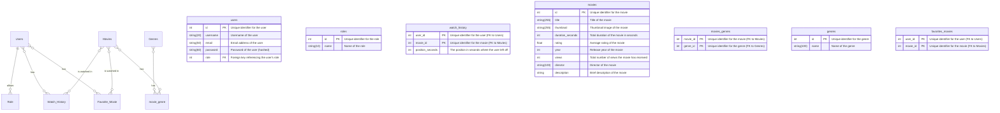

```mermaid
%% Relationship Notations:
%% |o : Represents "zero or one".
%% || : Represents "exactly one".
%% }o : Represents "zero or more".
%% }| : Represents "one or more".

erDiagram

    Users ||--o{ Role : allows

    Users }o--o{ Watch_History : "has"
    Movies }o--o{ Watch_History : "is watched in"

    Genres }o--o{ movie_genre : "has"
    Movies }o--o{ movie_genre : "has"

    Users }o--o{ Favorite_Movie : "has"
    Movies }o--o{ Favorite_Movie : "is watched in"

    users {
        int id PK "Unique identifier for the user"
        string(20) username "Username of the user"
        string(50) email "Email address of the user"
        string(60) password "Password of the user (hashed)"
        int role FK "Foreign key referencing the user's role"
    }
    
    roles {
        int id PK "Unique identifier for the role"
        string(10) name "Name of the role"
    }
    
    watch_history {
        int user_id PK "Unique identifier for the user (FK to Users)"
        int movie_id PK "Unique identifier for the movie (FK to Movies)"
        int position_seconds "The position in seconds where the user left off"
    }

    movies {
        int id PK "Unique identifier for the movie"
        string(255) title "Title of the movie"
        string(255) thumbnail "Thumbnail image of the movie"
        int duration_seconds "Total duration of the movie in seconds"
        float rating "Average rating of the movie"
        int year "Release year of the movie"
        int views "Total number of views the movie has received"
        string(100) director "Director of the movie"
        string description "Brief description of the movie"
    }

    movies_genres {
        int movie_id PK "Unique identifier for the movie (FK to Movies)"
        int genre_id PK "Unique identifier for the genre (FK to Genres)"
    }

    genres {
        int id PK "Unique identifier for the genre"
        string(100) name "Name of the genre"
    }

    favorites_movies {
        int user_id PK "Unique identifier for the user (FK to Users)"
        int movie_id PK "Unique identifier for the movie (FK to Movies)"
    }

```