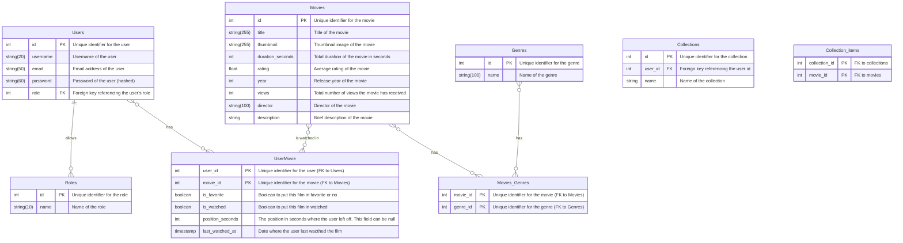

```mermaid
%% Relationship Notations:
%% |o : Represents "zero or one".
%% || : Represents "exactly one".
%% }o : Represents "zero or more".
%% }| : Represents "one or more".

erDiagram

    Users ||--o{ Roles : allows
    Users }o--o{ UserMovie : "has"
    Movies }o--o{ UserMovie : "is watched in"
    
    Genres }o--o{ Movies_Genres : "has"
    Movies }o--o{ Movies_Genres : "has"

    %% Definition des tables
    Users {
        int id PK "Unique identifier for the user"
        string(20) username "Username of the user"
        string(50) email "Email address of the user"
        string(60) password "Password of the user (hashed)"
        int role FK "Foreign key referencing the user's role"
    }
    
    Roles {
        int id PK "Unique identifier for the role"
        string(10) name "Name of the role"
    }

    UserMovie {
        int user_id PK "Unique identifier for the user (FK to Users)"
        int movie_id PK "Unique identifier for the movie (FK to Movies)"
        boolean is_favorite "Boolean to put this film in favorite or no"
        boolean is_watched "Boolean to put this film in watched"
        int position_seconds "The position in seconds where the user left off. This field can be null"
        timestamp last_watched_at "Date where the user last wacthed the film"
    }

    Movies {
        int id PK "Unique identifier for the movie"
        string(255) title "Title of the movie"
        string(255) thumbnail "Thumbnail image of the movie"
        int duration_seconds "Total duration of the movie in seconds"
        float rating "Average rating of the movie"
        int year "Release year of the movie"
        int views "Total number of views the movie has received"
        string(100) director "Director of the movie"
        string description "Brief description of the movie"
    }

    Movies_Genres {
        int movie_id PK "Unique identifier for the movie (FK to Movies)"
        int genre_id PK "Unique identifier for the genre (FK to Genres)"
    }

    Genres {
        int id PK "Unique identifier for the genre"
        string(100) name "Name of the genre"
    }

    Collections {
        int id PK "Unique identifier for the collection"
        int user_id FK "Foreign key referencing the user id"
        string name "Name of the collection"
    }

    Collection_items {
        int collection_id PK "FK to collections"
        int movie_id PK "FK to movies"
    }
```

